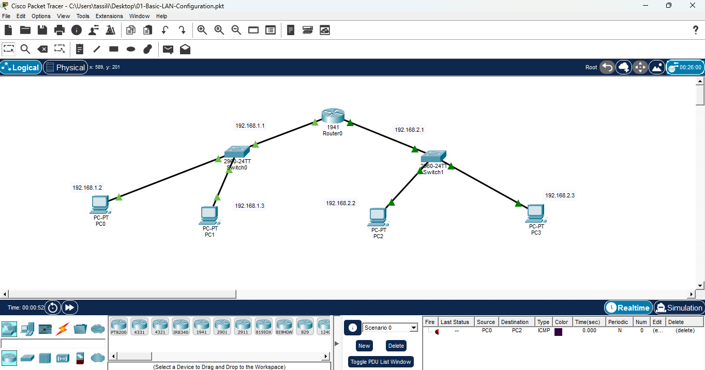

# Cisco Packet Tracer: Step-by-Step Networking Labs

Welcome! This repository is designed as a progressive learning path for networking beginners to build and understand their first topologies in Cisco Packet Tracer.

---

## 🛑 Lab 01: Basic LAN Configuration (Your First Topology)
The goal of this first lab is to understand the absolute basics of local area networks (LAN) without complex routing protocols.

### 🎯 Learning Objectives:
* How to connect end devices (PCs/Laptops) using the correct cables.
* How to configure and turn on Router/Switch interfaces.
* How to assign IP addresses and Subnet Masks to devices.
* How to use the `ping` command to test and verify connectivity.

### 📐 Network Diagram

